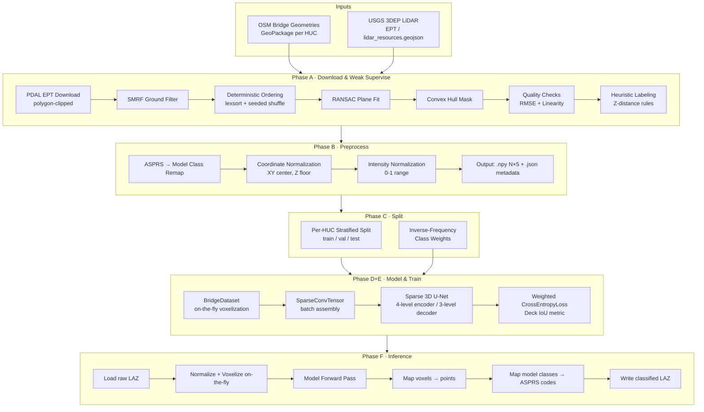

# System Architecture & Design

## Project Overview

**What**: Automated classification of 3D LiDAR point clouds around bridges into 4 semantic classes.

**Who**: Built for the NOAA Office of Water Prediction (OWP) to support the National Bridge Inventory. Bridges are a critical factor in flood inundation modeling — knowing which points are the deck enables accurate hydraulic analysis and better heal DEM for Flood Inundation Mapping (FIM) purpose.

**Scale**: Designed to process 550K+ bridges across the continental US using USGS 3DEP LiDAR data sourced from the Entwine Point Tile (EPT) format.

---

## System Architecture



---

## Classification Schema

The definitive 4-class reference. All other components must agree with this table.

| Model Class | Name | Description | ASPRS LAS Input Codes | ASPRS LAS Output Code |
|-------------|------|-------------|----------------------|-----------------------|
| **0** | Background/Unclassified | Piers, pylons, trees, low noise, birds; anything not covered by classes 1–3 | 1 (Unclassified), 7 (Low Noise), all others | 1 (Unclassified) |
| **1** | Ground/Water | Non-bridge surface: river banks, road approaches, water surface | 2 (Ground), 9 (Water) | 2 (Ground) |
| **2** | Bridge Deck | Primary target — the bridge pavement surface | 17 (Bridge Deck) | 17 (Bridge Deck) |
| **3** | Obstacles/High Noise | Objects on the bridge: cars, light poles, fences, wires, guard rails | 18 (High Noise) | 18 (High Noise) |

**Source references:**

- Input mapping: `src/preprocess_bridges.py` — `LAS_TO_MODEL_MAP`
- Output mapping: `src/inference.py` — `MODEL_TO_LAS_MAP`
- Class names: `src/train.py` — `CLASS_NAMES`

---

## Phase A: Silver Data Generation (Weak Supervision)

**Script**: `src/download-and-weak-supervise-hucs.py`

The weak supervision pipeline generates labeled training data automatically, avoiding the need for manual annotation at scale.

### Algorithm

1. **Input**: Bridge geometry (OSM LineString/Polygon) + EPT URL from `lidar_resources.geojson`
2. **Download**: PDAL `readers.ept` clips to a buffered bounding box around the bridge
   - Buffer: 10 m (configurable via `--buffer`)
3. **Ground Filtering**: SMRF (Simple Morphological Filter) assigns preliminary ground/non-ground labels
   - `scalar=1.25, slope=0.05, threshold=0.5, window=10.0`
   - Ignores existing noise labels (ASPRS 7)
4. **Deterministic Ordering**: Points sorted `np.lexsort((Z, Y, X))` then shuffled with `seed=27`
   - Required because EPT chunk order is non-deterministic and OS-dependent
5. **RANSAC Plane Fitting**: Fits a plane to the bridge deck
   - `min_samples=10, residual_threshold=0.20 m, random_state=27`
   - Excludes ASPRS classes 7 (noise), 9 (water), 18 (high noise) from fit candidates
6. **Convex Hull Masking**: Builds a 2D convex hull around RANSAC inliers; used to define the lateral extent of the bridge deck
7. **Quality Checks** (bridge rejected if either fails):
   - **Inlier RMSE** < 0.30 m
   - **Linearity**: skeleton Z-deviation < 0.35 m (rejects arched/curved bridges)
8. **Heuristic Classification** (Z-distance from RANSAC plane):
   - **Bridge Deck** (ASPRS 17): inside hull AND `-0.70 m ≤ ΔZ ≤ +0.20 m`
   - **Obstacles** (ASPRS 18): inside hull AND `+0.20 m < ΔZ < +15.0 m`

### Configuration: `BridgeProcessingConfig`

All parameters are centralised in the `BridgeProcessingConfig` dataclass. Key fields:

| Parameter | Default | Description |
|-----------|---------|-------------|
| `pdal_ept_resolution` | 0.1 | EPT download resolution (m) |
| `pdal_smrf_scalar` | 1.25 | SMRF scalar |
| `ransac_residual_threshold` | 0.20 | RANSAC inlier threshold (m) |
| `ransac_random_state` | 27 | RANSAC random seed |
| `max_rmse` | 0.30 | Max allowed inlier RMSE (m) |
| `linearity_final_deviation_threshold` | 0.35 | Max skeleton Z-deviation (m) |
| `deck_z_min` / `deck_z_max` | -0.70 / +0.20 | Z range for deck classification (m) |
| `noise_z_min` / `noise_z_max` | +0.20 / +15.0 | Z range for obstacle classification (m) |
| `default_buffer_meters` | 10.0 | Bridge geometry buffer (m) |
| `deterministic_ordering_seed` | 27 | Seed for pre-RANSAC shuffle |

---

## Phase B: Preprocessing

**Script**: `src/preprocess_bridges.py`

Converts weak-supervised LAZ files to normalized NumPy arrays for training.

### Steps

1. **Read LAZ**: PDAL `readers.las` extracts X, Y, Z, Intensity, Classification
2. **Class remapping** (`LAS_TO_MODEL_MAP`): ASPRS codes → model classes 0–3; all unmapped codes → 0 (Background)
3. **Coordinate normalization**:
   - `X_norm = X − mean(X)`, `Y_norm = Y − mean(Y)` (bridge centered at origin)
   - `Z_norm = Z − min(Z)` (relative height, zero-floored)
4. **Intensity normalization**: `I_norm = Intensity / max(Intensity)` → 0–1 range
5. **Output**:
   - `.npy`: `(N, 5)` float32 — columns `[x, y, z, intensity, label]`
   - `.json`: offsets, point count, class distribution (used for class weight calculation)

### Normalization offsets (stored in `.json`)

```json
{
  "offsets": {
    "x_center": -8548539.41,
    "y_center": 4995360.81,
    "z_min": 128.93
  }
}
```

These offsets allow reconstructing absolute coordinates from normalized data if needed.

---

## Phase C: Data Splitting

**Script**: `utils/split_data.py`

### Strategy

- All bridges within a HUC go to the **same split** (prevents spatial leakage between nearby bridges)
- Default ratios: 80% train / 20% validation (configurable via `--train-ratio`, `--val-ratio`)
- **Holdout test set**: Fixed bridge IDs from a file (`--holdout-test-ids`) are reserved for testing regardless of the split ratios
- **Symlink mode** (`--symlink`): Creates symlinks instead of copies, saving disk space for large datasets

### Outputs

- `training/`, `validation/`, `testing/` — HUC-organized directories with `.npy` + `.json` files
- `split_manifest.json`, `split_{train,val,test}_ids.txt` — manifest files for reproducibility

### Class Weights (`utils/calculate_weights.py`)

Reads `.json` metadata from `training/` and computes inverse-frequency weights:

```
W_c = Total_Points / (N_classes × Count_c)
```

Output: `class_weights.json` with a `"weights"` list ordered `[w0, w1, w2, w3]`.

---

## Phase D: Model Architecture

**Module**: `src/model.py`

### Sparse 3D U-Net (`SparseUNet`)

A U-Net architecture operating on sparse voxel grids using [SpConv](https://github.com/traveller59/spconv).

```
Input: SparseConvTensor (N_voxels × 1 intensity channel)
│
├── ENCODER
│   ├── Input Block: SubMConv3d(1 → 16) + BN + ReLU
│   ├── Enc1: ResidualBlock(16 → 16)                    ← skip e1
│   ├── Down1: SparseConv3d(16 → 32, stride=2)
│   ├── Enc2: ResidualBlock(32 → 32)                    ← skip e2
│   ├── Down2: SparseConv3d(32 → 64, stride=2)
│   ├── Enc3: ResidualBlock(64 → 64)                    ← skip e3
│   ├── Down3: SparseConv3d(64 → 128, stride=2)
│   └── Bottleneck: ResidualBlock(128 → 128)
│
└── DECODER
    ├── Up3: SparseInverseConv3d(128 → 64) + cat(e3) → ResidualBlock(128 → 64)
    ├── Up2: SparseInverseConv3d(64 → 32)  + cat(e2) → ResidualBlock(64 → 32)
    ├── Up1: SparseInverseConv3d(32 → 16)  + cat(e1) → ResidualBlock(32 → 16)
    └── Head: SubMConv3d(16 → 4)

Output: (N_voxels, 4) logits
```

### `ResidualBlock`

Two `SubMConv3d` layers (maintains sparsity pattern) with a shortcut connection (1×1 conv if channel mismatch).

### Key design choices

- **SubMConv3d** for residual blocks: keeps active voxels unchanged (no new voxels created)
- **SparseConv3d** for downsampling: stride=2 reduces spatial resolution, doubles channels
- **SparseInverseConv3d** for upsampling: exactly reverses the spatial layout of the corresponding downsample
- **Skip connections**: features concatenated (not added) before decoder residual blocks

---

## Phase E: Training

**Script**: `src/train.py`

### Data Loading

`BridgeDataset` performs on-the-fly voxelization:

1. Load `.npy` → split into xyz, intensity, labels
2. Shift `xyz -= xyz.min()` (guarantees non-negative SpConv indices)
3. Optional augmentation: random Z-axis rotation + Gaussian jitter (`σ=0.01 m`)
4. Quantize: `discrete_coords = floor(xyz / voxel_size)` → int32
5. Aggregate voxels: mean intensity, majority-vote labels (`aggregate_voxel_points`)
6. Optional cap: randomly subsample to `max_voxels` if exceeded (OOM prevention)

`sparse_collate_fn` prepends a batch index to coordinates: `[batch_id, x, y, z]`.

### Training Configuration

| Component | Detail |
|-----------|--------|
| Framework | PyTorch Lightning |
| Optimizer | AdamW (`lr=0.001`, `weight_decay=0.01`) |
| Scheduler | ReduceLROnPlateau (`factor=0.5`, `patience=5`, `min_lr=1e-6`) |
| Loss | Weighted CrossEntropyLoss (inverse-frequency weights) |
| Primary metric | **Deck IoU** (Bridge Deck class intersection-over-union) |
| Checkpointing | Top-5 by monitored metric + `last.ckpt` |
| Mixed precision | `16-mixed` (AMP) |
| OOM handling | CUDA OOM caught per batch; batch skipped, cache cleared |

---

## Phase F: Inference

**Script**: `src/inference.py`

1. Load checkpoint → `SparseUNet(input_channels=1, num_classes=4)`
2. Read raw LAZ via PDAL
3. Normalize on-the-fly: `xyz -= xyz.min()`, `intensity /= max(intensity)`
4. Voxelize: `discrete_coords = floor(xyz / voxel_size)`
5. Find unique voxels + inverse mapping (`np.unique(..., return_inverse=True)`)
6. Aggregate mean intensity per voxel
7. Build `SparseConvTensor`, run `model.forward()` with `torch.no_grad()`
8. `argmax` → voxel predictions
9. Map back to original points via `unique_inverse_indices`
10. Map model classes → ASPRS codes via `MODEL_TO_LAS_MAP`
11. Write classified LAZ via PDAL (preserves all original fields)
