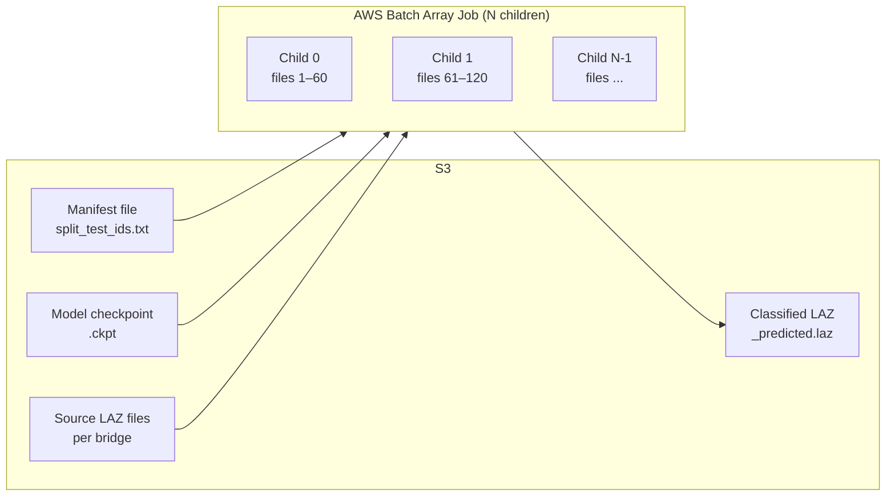

# AWS Batch Inference

Scale inference to hundreds of thousands of bridges in parallel using AWS Batch array jobs. Infrastructure is managed with Terraform; job submission and Docker builds are handled by shell scripts.

Each array child downloads a **chunk** of the manifest (default ~60 files), loads the model once, runs batch inference, and uploads the classified results to S3.

**Key files**:

| File | Purpose |
|------|---------|
| `terraform/` | Infrastructure as code (ECR, compute env, queue, job definition) |
| `terraform/terraform.tfvars` | All configurable values — gitignored; copy from `.tfvars.example` |
| `terraform/terraform.tfvars.example` | Template with placeholder values for new setups |
| `scripts/build_and_push.sh` | Build Docker image and push to ECR |
| `scripts/submit_batch_job.sh` | Submit single or array batch jobs |
| `scripts/batch_entrypoint.sh` | Container entrypoint (download, infer, upload) |

---

## Overview



Each child:

1. Downloads the full manifest and model from S3
2. Computes its chunk of manifest lines based on `AWS_BATCH_JOB_ARRAY_INDEX` and `ARRAY_SIZE`
3. Downloads all input files for its chunk
4. Runs `src/inference.py --pairs-file` (model loaded once, all files processed in batch)
5. Uploads `{bridge_stem}_predicted.laz` results to S3

---

## Prerequisites

- AWS account with IAM permissions for Batch, ECR, S3
- [Terraform](https://developer.hashicorp.com/terraform/install) installed
- Docker installed (for building images)
- Trained model checkpoint uploaded to S3
- A manifest file listing bridges to process (one per line)

---

## Quick Start

### 1. Configure

Copy the example and fill in your values (`terraform.tfvars` is gitignored):

```bash
cp terraform/terraform.tfvars.example terraform/terraform.tfvars
```

Edit `terraform/terraform.tfvars` with your S3 paths, model, and AWS settings:

```hcl
# terraform/terraform.tfvars

# S3 / Inference config — change these for new runs
s3_bucket        = "fimc-data"
s3_input_prefix  = "bridge-classification/ml-data/source"
s3_manifest_uri  = "s3://fimc-data/bridge-classification/ml-data/split_test_ids.txt"
s3_model_uri     = "s3://fimc-data/path/to/your-model.ckpt"
s3_output_prefix = "scratch/your-name/predictions"

# Compute (optional tweaks)
use_spot       = false          # true for ~60-70% cost savings (risk of interruption)
instance_types = ["g4dn.xlarge"]
max_vcpus      = 256
```

See [Configuration Reference](#configuration-reference) for all available options.

### 2. Deploy Infrastructure

```bash
cd terraform
terraform init      # first time only
terraform plan      # preview changes
terraform apply     # create/update resources
```

This creates: ECR repository, Batch compute environment, job queue, and job definition (with your S3 config baked into the job definition env vars).

### 3. Build and Push Docker Image

```bash
cd ..
chmod +x ./scripts/build_and_push.sh
./scripts/build_and_push.sh
```

Only needed when you change code (`src/`, `scripts/batch_entrypoint.sh`, or `Dockerfile`). Changing S3 paths in `terraform.tfvars` does **not** require a rebuild — those are environment variables in the job definition.

### 4. Submit a Job

```bash
# Test with a single container (processes all files sequentially)
./scripts/submit_batch_job.sh --single

# Array job — provide manifest S3 URI (streams to count lines, sets S3_MANIFEST_URI override)
S3_PROFILE=Data ./scripts/submit_batch_job.sh --manifest s3://fimc-data/bridge-classification/ml-data/split_test_ids.txt

# Or provide the count explicitly (uses S3_MANIFEST_URI from Terraform job definition)
./scripts/submit_batch_job.sh --total 600000
```

### 5. Monitor

The submit script prints links to both the Batch console and CloudWatch logs. Logs are written to a dedicated log group (`/aws/batch/bridge-classifier`) with **1-year retention** — old logs are automatically deleted.

Log lines include `(bridge=<bridge_id>)` for per-bridge granularity. Filter CloudWatch by bridge ID to track individual file processing.

```bash
# List running jobs
aws batch list-jobs --job-queue bridge-classifier-inference-queue --job-status RUNNING --profile test-se

# Tail logs for a specific child (replace log stream name)
aws logs tail /aws/batch/bridge-classifier --follow --profile test-se
```

### 6. Cleanup

To tear down all Batch infrastructure:

```bash
cd terraform
terraform destroy
```

This removes the ECR repository, compute environment, job queue, and job definition. It does **not** delete S3 data or IAM roles.

To clean up manually (without terraform):

```bash
# 1. Disable and delete job queue
aws batch update-job-queue --job-queue bridge-classifier-inference-queue --state DISABLED --profile test-se
aws batch delete-job-queue --job-queue bridge-classifier-inference-queue --profile test-se

# 2. Disable and delete compute environment (wait for queue deletion first)
aws batch update-compute-environment --compute-environment bridge-classifier-gpu-ec2 --state DISABLED --profile test-se
aws batch delete-compute-environment --compute-environment bridge-classifier-gpu-ec2 --profile test-se

# 3. Deregister job definition
aws batch deregister-job-definition --job-definition bridge-classifier-inference:1 --profile test-se
```

---

## What to Change Where

| Want to change... | Edit | Then run |
|---|---|---|
| Model checkpoint | `terraform/terraform.tfvars` → `s3_model_uri` | `terraform apply` |
| Manifest (file list) | `terraform/terraform.tfvars` → `s3_manifest_uri` | `terraform apply` (or `--manifest s3://...` per-run) |
| Output location | `terraform/terraform.tfvars` → `s3_output_prefix` | `terraform apply` |
| GPU instance type | `terraform/terraform.tfvars` → `instance_types` | `terraform apply` |
| Spot vs On-Demand | `terraform/terraform.tfvars` → `use_spot` | `terraform apply` |
| Files per container | Set env var at submit time | `CHUNK_TARGET=100 ./scripts/submit_batch_job.sh --total N` |
| Inference code | Edit `src/inference.py` or `scripts/batch_entrypoint.sh` | `./scripts/build_and_push.sh`, then resubmit |
| Job memory/vCPUs | `terraform/terraform.tfvars` → `job_memory`, `job_vcpus` | `terraform apply` |

**One-time override without changing terraform:**

```bash
# Override manifest for one run (also sets S3_MANIFEST_URI container override)
S3_PROFILE=Data ./scripts/submit_batch_job.sh --manifest s3://fimc-data/path/to/other-manifest.txt

# Override model and output for one run
S3_PROFILE=Data \
S3_MODEL_URI=s3://fimc-data/path/to/other-model.ckpt \
S3_OUTPUT_PREFIX=scratch/experiment-2/predictions \
  ./scripts/submit_batch_job.sh --manifest s3://fimc-data/path/to/manifest.txt
```

These are passed as container env overrides and take precedence over the terraform defaults for that job only.

`S3_PROFILE` controls which AWS profile is used to read the manifest from S3 (for line counting). It defaults to `AWS_PROFILE` (`test-se`). Set it when S3 and Batch use different profiles.

---

## How Chunking Works

The submit script computes how many array children to create:

```
ARRAY_SIZE = ceil(TOTAL_FILES / CHUNK_TARGET)
```

- `CHUNK_TARGET` defaults to 60 (files per container)
- `ARRAY_SIZE` is capped at 10,000 (AWS Batch hard limit)

Each child computes its chunk at runtime from the actual manifest:

```bash
TOTAL_FILES=$(wc -l < manifest.txt)
CHUNK_SIZE=$(( (TOTAL_FILES + ARRAY_SIZE - 1) / ARRAY_SIZE ))
START=$(( JOB_INDEX * CHUNK_SIZE + 1 ))
END=$(( START + CHUNK_SIZE - 1 ))
```

Example with 600,000 files:

| | Value |
|---|---|
| CHUNK_TARGET | 60 |
| ARRAY_SIZE | 10,000 children |
| Files per child | ~60 |

The entrypoint re-counts the actual manifest, so chunk boundaries adapt even if `--total` was approximate.

---

## Environment Variable Validation

The entrypoint **validates** that all required S3 env vars are set at startup — there are no hardcoded defaults in the script. If any are missing, it fails fast with a clear error listing the missing variables:

```
ERROR: required environment variables not set: S3_BUCKET S3_MANIFEST_URI
These should be set in the Batch job definition (managed by Terraform).
```

Required: `S3_BUCKET`, `S3_INPUT_PREFIX`, `S3_MANIFEST_URI`, `S3_MODEL_URI`, `S3_OUTPUT_PREFIX`

Optional: `USE_GPU` (defaults to `true`)

The Terraform job definition is the single source of truth for these values. The `--manifest` flag on the submit script overrides `S3_MANIFEST_URI` for that run.

---

## Manifest File Format

One bridge per line. Two formats are supported:

**Relative path** (`.laz` appended automatically):
```
02050206/bridge_10598181_USGS_LPC_PA_South_Central_B2_2017_LAS_2019
03070101/bridge_5069009_USGS_LPC_PA_South_Central_B2_2017_LAS_2019
```

**Full S3 URI** (used as-is):
```
s3://my-bucket/path/to/bridge_xyz.laz
```

The split manifest produced by `utils/split_data.py` (`split_test_ids.txt`) is directly usable.

---

## Configuration Reference

All variables are defined in `terraform/variables.tf` with defaults. Override them in `terraform/terraform.tfvars`.

### AWS & General

| Variable | Default | Description |
|----------|---------|-------------|
| `aws_region` | `us-east-1` | AWS region |
| `aws_profile` | `test-se` | AWS CLI profile (used for Batch API) |
| `s3_profile` | *(same as aws_profile)* | AWS CLI profile for S3 access (set via `S3_PROFILE` env var at submit time) |
| `project_name` | `bridge-classifier` | Prefix for all resource names |

### IAM Roles (existing — not managed by Terraform)

| Variable | Description |
|----------|-------------|
| `batch_job_role_arn` | IAM role for job containers (needs S3 read/write) |
| `batch_instance_profile` | EC2 instance profile for compute instances |
| `spot_fleet_role_arn` | EC2 Spot Fleet role (only used when `use_spot = true`) |
| `batch_service_role_arn` | AWS Batch service-linked role |

### Compute

| Variable | Default | Description |
|----------|---------|-------------|
| `instance_types` | `["g4dn.xlarge"]` | GPU instance type(s) |
| `max_vcpus` | `256` | Max vCPUs across all instances |
| `use_spot` | `true` | Use Spot instances (cheaper, risk of interruption) |

### Job Definition

| Variable | Default | Description |
|----------|---------|-------------|
| `job_vcpus` | `3` | vCPUs per container |
| `job_memory` | `15000` | Memory (MB) per container |
| `shared_memory_size` | `4096` | Shared memory (MB) for PyTorch/spconv |

### S3 / Inference

| Variable | Default | Description |
|----------|---------|-------------|
| `s3_bucket` | `fimc-data` | S3 bucket for all I/O |
| `s3_input_prefix` | `bridge-classification/ml-data/source` | Prefix for source LAZ files |
| `s3_manifest_uri` | `s3://fimc-data/.../split_test_ids.txt` | Full S3 URI of manifest |
| `s3_model_uri` | *(see tfvars)* | Full S3 URI of model checkpoint |
| `s3_output_prefix` | `scratch/.../predictions` | Where `_predicted.laz` files are uploaded |

---

## Terraform Outputs

After `terraform apply`, these are available to scripts (and for reference):

```bash
terraform output
```

| Output | Description |
|--------|-------------|
| `ecr_repository_url` | ECR URL for `docker push` |
| `job_definition_name` | Batch job definition name |
| `job_queue_name` | Batch job queue name |
| `compute_environment_name` | Batch compute environment name |
| `s3_manifest_uri` | S3 manifest URI (used by submit script auto-counting) |
| `log_group_name` | CloudWatch log group for Batch job logs |

---

## Cost Tracking

All Batch resources are tagged with `Project = bridge-classifier`. Tags propagate to the underlying ECS tasks via `propagate_tags = true` on the job definition.

**Cost Explorer:** Go to [AWS Cost Explorer](https://console.aws.amazon.com/cost-management/home#/cost-explorer), group by **Tag → Project**, and filter to `bridge-classifier`. Enable the `Project` tag in **Billing → Cost allocation tags** if it doesn't appear yet.

---

## Output

Each successful child uploads:

```
s3://{S3_BUCKET}/{S3_OUTPUT_PREFIX}/{bridge_stem}_predicted.laz
```

The output LAZ preserves all original fields (GPS time, return number, etc.) with only the `Classification` field updated to ASPRS codes:

| Code | Class |
|------|-------|
| 1 | Unclassified (Background) |
| 2 | Ground |
| 17 | Bridge Deck |
| 18 | High Noise (Obstacles) |

---

## Instance Recommendations

| Instance | GPU | GPU RAM | vCPU | RAM | Notes |
|----------|-----|---------|------|-----|-------|
| `g4dn.xlarge` | 1x T4 | 16 GB | 4 | 16 GB | Current default; good for inference |
| `g5.xlarge` | 1x A10G | 24 GB | 4 | 16 GB | Faster GPU; good for large bridges |
| `g5.2xlarge` | 1x A10G | 24 GB | 8 | 32 GB | More CPU/RAM headroom |

Set `USE_GPU=false` in the job definition for CPU-only instances (slower but no GPU cost).

---

## Troubleshooting

**Job stuck in RUNNABLE**: Compute environment may not have capacity. Check that `max_vcpus` is sufficient and the instance type is available in your subnets/AZs.

**"Cannot determine manifest or file count" error**: The submit script needs the file count for array jobs. Use `--manifest <s3-uri>` (also sets `S3_MANIFEST_URI` override) or `--total <N>` (uses `S3_MANIFEST_URI` from job definition).

**"Required environment variables not set" error**: The entrypoint validates that all S3 env vars are set. These come from the Terraform job definition. Run `terraform apply` to ensure the job definition has all required env vars.

**Model loading errors**: Ensure the checkpoint was saved by `BridgeLightningModule` (Lightning format with `state_dict` key). The inference script handles both Lightning checkpoints and raw state dicts.

**GPU out of memory**: Large bridges with dense point clouds can exceed GPU memory. Either use a larger instance or add `--voxel-size 0.10` to the inference command in `batch_entrypoint.sh` (coarser voxels = fewer voxels = less memory).

**S3 permission denied**: Verify the Batch job IAM role (`batch_job_role_arn`) has `s3:GetObject` on the input bucket and `s3:PutObject` on the output prefix.

**Spot instance interruptions**: If using `use_spot = true`, jobs may be interrupted. AWS Batch will automatically retry. For critical runs, set `use_spot = false` in `terraform.tfvars`.
