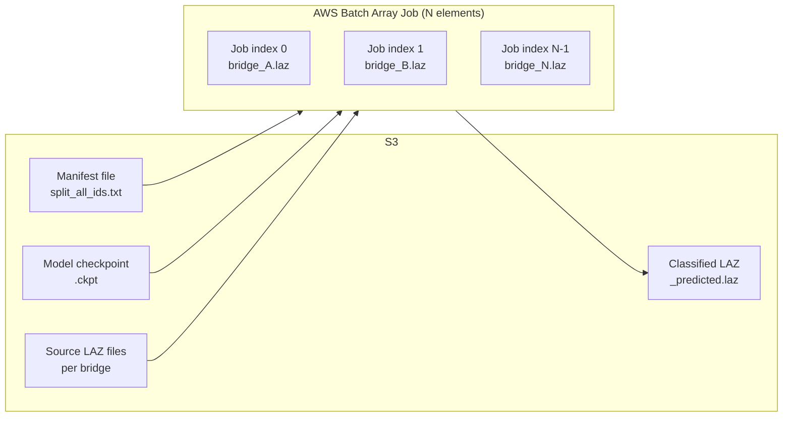

# AWS Batch Inference

Scale inference to thousands of bridges in parallel using AWS Batch array jobs. Each array element processes one bridge: downloads from S3, runs inference, uploads the classified result.

**Script**: `scripts/batch_entrypoint.sh`

---

## Overview



Each job element reads one line from the manifest (by `AWS_BATCH_JOB_ARRAY_INDEX`), downloads the corresponding LAZ from S3, runs `src/inference.py`, and uploads `{bridge_stem}_predicted.laz` back to S3.

---

## Prerequisites

- AWS account with IAM permissions for Batch, ECR, S3
- Docker image built and pushed to ECR (see below)
- Trained model checkpoint uploaded to S3
- A manifest file listing bridges to process (one per line)

---

## Docker Image

The same Docker image used for training is used for inference.

```bash
# Build
docker build -t bridge-classifier .

# Tag for ECR
aws ecr get-login-password --region <region> | \
  docker login --username AWS --password-stdin \
  <account_id>.dkr.ecr.<region>.amazonaws.com

docker tag bridge-classifier:latest \
  <account_id>.dkr.ecr.<region>.amazonaws.com/bridge-classifier:latest

# Push
docker push <account_id>.dkr.ecr.<region>.amazonaws.com/bridge-classifier:latest
```

---

## Manifest File Format

One bridge per line. Two formats are supported:

**Relative path** (`.laz` appended automatically):
```
02050206/bridge_10598181_USGS_LPC_PA_South_Central_B2_2017_LAS_2019
03070101/bridge_5069009_USGS_LPC_PA_South_Central_B2_2017_LAS_2019
```

**Full S3 URI** (used as-is):
```
s3://my-bucket/path/to/bridge_xyz.laz
```

The split manifest produced by `utils/split_data.py` (`split_test_ids.txt`) is directly usable as a manifest file.

**Upload to S3**:
```bash
aws s3 cp split_test_ids.txt s3://fimc-data/bridge-classification/ml-data/split_test_ids.txt
```

---

## Environment Variables

All configuration is passed via environment variables. Defaults match the current deployment.

| Variable | Default | Description |
|----------|---------|-------------|
| `S3_BUCKET` | `fimc-data` | S3 bucket name for all I/O |
| `S3_INPUT_PREFIX` | `bridge-classification/ml-data/source` | Prefix for source LAZ files (used with relative manifest lines) |
| `S3_MANIFEST_URI` | `s3://fimc-data/bridge-classification/ml-data/split_test_ids.txt` | Full S3 URI of the manifest file |
| `S3_MODEL_URI` | *(see script default)* | Full S3 URI of the trained `.ckpt` checkpoint |
| `S3_OUTPUT_PREFIX` | `scratch/.../predictions` | S3 key prefix where `_predicted.laz` files are uploaded |
| `USE_GPU` | `true` | Pass `--gpu` to `inference.py` when `true`; use CPU when `false` |

`AWS_BATCH_JOB_ARRAY_INDEX` is set automatically by AWS Batch for array jobs (0-indexed). It defaults to `0` for single-job testing.

---

## Job Definition Setup

Create an AWS Batch job definition with:

```json
{
  "jobDefinitionName": "bridge-inference",
  "type": "container",
  "containerProperties": {
    "image": "<account_id>.dkr.ecr.<region>.amazonaws.com/bridge-classifier:latest",
    "command": ["scripts/batch_entrypoint.sh"],
    "resourceRequirements": [
      {"type": "VCPU", "value": "4"},
      {"type": "MEMORY", "value": "16384"},
      {"type": "GPU", "value": "1"}
    ],
    "environment": [
      {"name": "S3_BUCKET", "value": "fimc-data"},
      {"name": "S3_MANIFEST_URI", "value": "s3://fimc-data/bridge-classification/ml-data/split_test_ids.txt"},
      {"name": "S3_MODEL_URI", "value": "s3://fimc-data/.../model.ckpt"},
      {"name": "S3_OUTPUT_PREFIX", "value": "predictions/run-001"},
      {"name": "USE_GPU", "value": "true"}
    ],
    "jobRoleArn": "arn:aws:iam::<account_id>:role/BatchJobRole"
  }
}
```

The IAM role needs: `s3:GetObject` on the input bucket, `s3:PutObject` on the output prefix.

---

## Submitting an Array Job

```bash
# Count manifest lines to set array size
N=$(aws s3 cp s3://fimc-data/.../split_test_ids.txt - | wc -l)

aws batch submit-job \
  --job-name bridge-inference-run-001 \
  --job-queue <your-gpu-queue> \
  --job-definition bridge-inference \
  --array-properties size=${N} \
  --container-overrides '{
    "environment": [
      {"name": "S3_MODEL_URI", "value": "s3://fimc-data/.../best.ckpt"},
      {"name": "S3_OUTPUT_PREFIX", "value": "predictions/run-001"}
    ]
  }'
```

---

## Output

Each successful job produces:

```
s3://{S3_BUCKET}/{S3_OUTPUT_PREFIX}/{bridge_stem}_predicted.laz
```

For example, if the manifest line is `02050206/bridge_10598181_USGS_LPC_PA_...` and `S3_OUTPUT_PREFIX=predictions/run-001`:

```
s3://fimc-data/predictions/run-001/bridge_10598181_USGS_LPC_PA_..._predicted.laz
```

The output LAZ preserves all original fields (GPS time, return number, etc.) with only the `Classification` field updated to ASPRS codes (1, 2, 17, 18).

---

## Instance Recommendations

| Instance | GPU | GPU RAM | vCPU | RAM | Notes |
|----------|-----|---------|------|-----|-------|
| `g5.xlarge` | 1× A10G | 24 GB | 4 | 16 GB | Sufficient for most bridges |
| `g5.2xlarge` | 1× A10G | 24 GB | 8 | 32 GB | Better for large bridges or high throughput |
| `g5.4xlarge` | 1× A10G | 24 GB | 16 | 64 GB | Used for training; overkill for inference |

Set `USE_GPU=false` for CPU-only instances (slower but no GPU cost).

---

## Troubleshooting

**"No manifest line for index N"**: Array size exceeds the number of lines in the manifest. Check `N` matches `wc -l` of the manifest.

**Model loading errors**: Ensure the checkpoint was saved by `BridgeLightningModule` (Lightning format with `state_dict` key). The inference script handles both Lightning checkpoints and raw state dicts.

**GPU out of memory**: Large bridges with dense point clouds can exceed GPU memory. Either use a larger instance or add `--voxel-size 0.10` to the inference command in `batch_entrypoint.sh` (coarser voxels = fewer voxels = less memory).

**S3 permission denied**: Verify the Batch job IAM role has `s3:GetObject` on the source bucket and `s3:PutObject` on the output prefix.

**Missing `aws` CLI inside container**: The Docker image must include `awscli`. Add `RUN pip install awscli` to the Dockerfile if missing.
