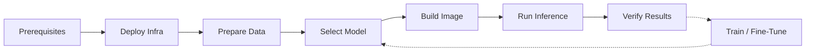

# Deployment Runbook

End-to-end guide from cloning the repo to running inference at scale.



---

## 1. Prerequisites

- **AWS account** with IAM Identity Center (SSO) profile configured. See [AWS Batch Inference: Prerequisites](aws-batch-inference.md#prerequisites).
- **Terraform** >= 1.14 installed ([install guide](https://developer.hashicorp.com/terraform/install)).
- **Docker** installed.
- **Python environment** - see the [README](https://github.com/NGWPC/bridge-classification#readme) for setup options:

| Task | Environment |
|------|-------------|
| Job submission, audit, reporting | `pip install boto3` (minimal) or `environment-data.yaml` |
| Data processing (weak supervision) | `environment-data.yaml` (Linux only) |
| Training / inference (GPU) | `environment.yaml` or Docker |
| Tests | `pip install -r requirements-test.txt` |

- **For training:** NVIDIA GPU required. The model uses `spconv-cu120` which requires CUDA 12.

---

## 2. Deploy Infrastructure

Follow the [Terraform README](https://github.com/NGWPC/bridge-classification/blob/main/infra/terraform/README.md) to deploy:

```
bootstrap (optional) -> foundation (optional) -> app
```

Each layer has `backend.hcl.example` and `terraform.tfvars.example` - copy both and fill in your values.

**Key options:**

| Scenario | What to do |
|----------|-----------|
| Fresh account, no existing resources | Run all layers: `create_networking = true` in foundation, `create_iam = true` in app |
| Existing S3 bucket for state | Skip bootstrap, point `backend.hcl` at your bucket with a key prefix |
| Existing VPC and IAM roles | Skip foundation, set `create_iam = false` in app, provide existing ARNs/IDs and VPC/subnet IDs |
| Using GHCR (default) | Set `create_ecr = false` and `inference_image_repo` in app |
| Using ECR | Set `create_ecr = true` in app (default) |

Set your AWS profile before running any commands:

```bash
export AWS_PROFILE=<your-profile>
```

For day-to-day config changes (S3 paths, model URI, instance types), only the app layer needs re-applying:

```bash
cd infra/terraform/app
terraform plan && terraform apply
```

---

## 3. Prepare Your Data

### Create a manifest for inference

A manifest is a text file with one bridge per line in the format `huc_id/bridge_stem`:

```
02050206/bridge_10598181_USGS_LPC_PA_SouthwestPA_2019
03070101/bridge_5069009_USGS_LPC_NC_Phase6_2016
```

To create a manifest from your processed data:

```bash
# List all source files and format as manifest lines
find data/ml-data/source -name '*.laz' \
    | sed 's|.*/source/||; s|\.laz$||' \
    | sort > manifest.txt

# Upload to S3
aws s3 cp manifest.txt s3://<bucket>/<prefix>/manifest.txt --profile <profile>
```

The `utils/split_data.py` script also generates manifests (`split_train_ids.txt`, `split_val_ids.txt`, `split_test_ids.txt`) during train/val/test splitting.

---

## 4. Select a Model

### List registered models

```bash
python utils/compare_experiments.py --bucket <bucket> --prefix <model-prefix>
```

Prints a comparison table of registered models and evaluation metrics.

### Current production model

`bridge-base-all-data-v5` (val deck IoU: 85.8%, test deck IoU: 60.0%).

Model checkpoint URI format:

```
s3://<bucket>/bridge-classification/models/<model-name>/checkpoints/<checkpoint-file>.ckpt
```

### Register and promote models

```bash
# Register a new model (after training + evaluation)
python utils/register_model.py \
    --bucket <bucket> --prefix <model-prefix> \
    --model-name my-new-model \
    --checkpoint ./experiments/my-experiment/version_0/checkpoints/best.ckpt

# Promote to production
python utils/promote_model.py \
    --bucket <bucket> --prefix <model-prefix> \
    --model-name my-new-model
```

See [API Reference: Inference & Cloud](api/inference-cloud.md) for registry function details.

---

## 5. Build & Push Docker Image

**GHCR (default):** images are published automatically on push to main by the `build-dev-images` GitHub Actions workflow.
Tags: `sha-<short>` (immutable) + `dev` (floating).
No manual steps needed.

**ECR (manual, when `create_ecr = true`):**

```bash
export AWS_PROFILE=<infra-profile>
chmod +x ./scripts/build_and_push.sh
./scripts/build_and_push.sh
```

Reads image repo and region from terraform outputs.

**When to rebuild:** only when you change code (`src/`, `scripts/`, or `Dockerfile`).
Changing S3 paths, model URI, or inference config in `terraform.tfvars` does NOT require a rebuild - those are environment variables in the job definition.

See [AWS Batch Inference: Build and Push](aws-batch-inference.md#2-build-and-push-docker-image) for details.

---

## 6. Run Inference

### Dry run (preview without submitting)

```bash
python scripts/submit_batch_job.py \
    --manifest s3://<bucket>/<prefix>/manifest.txt \
    --profile <data-profile> \
    --dry-run
```

### Submit

```bash
python scripts/submit_batch_job.py \
    --manifest s3://<bucket>/<prefix>/manifest.txt \
    --profile <data-profile>
```

**Cross-account setup:** use `--profile` for S3 data access and `AWS_PROFILE` for Batch operations.
Override output location with `--env S3_OUTPUT_PREFIX=<path>`.

### Monitor

```bash
aws logs tail /aws/batch/bridge-classifier --follow --profile <infra-profile>
```

See [AWS Batch Inference: Submit a Job](aws-batch-inference.md#3-submit-a-job) and [Monitor](aws-batch-inference.md#4-monitor) for full options.

---

## 7. Verify Results

### Post-run report

```bash
python scripts/post_run_report.py \
    --output-prefix <s3-output-prefix> \
    --mode masked \
    --profile <data-profile> \
    --batch-profile <infra-profile>
```

Do not include a trailing slash on `--output-prefix`.
The report auto-discovers `--bucket` from terraform outputs.

See [AWS Batch Inference: Post-Run Report](aws-batch-inference.md#6-post-run-report) for details.

### Re-run failed or missing bridges

```bash
# 1. Audit outputs to find missing bridges
python scripts/audit_outputs.py \
    --bucket <bucket> \
    --output-prefix <prefix> \
    --manifest s3://<bucket>/<prefix>/manifest.txt \
    --profile <data-profile> \
    --write-missing missing_bridges.txt

# 2. Upload the missing manifest and resubmit
aws s3 cp missing_bridges.txt s3://<bucket>/<prefix>/missing_manifest.txt --profile <data-profile>

python scripts/submit_batch_job.py \
    --manifest s3://<bucket>/<prefix>/missing_manifest.txt \
    --profile <data-profile>
```

---

## 8. Train or Fine-Tune a Model

### Environment

Training requires a GPU with CUDA 12. Set up the environment:

```bash
conda env create -f environment.yaml
conda activate bridge-classify
```

### Data preparation

Prepare training data from bridge geometries (see [Data Pipeline](data-pipeline.md) for details):

```bash
# 1. Download per-HUC bridge data from S3
python utils/download_osm_hucs.py --bucket <bucket> --prefix <prefix> --output-dir ./data/osm/hucs

# 2. Download LiDAR and run weak supervision (silver labels)
python src/download_and_weak_supervise_hucs.py \
    --hucs-dir ./data/osm/hucs \
    --source-dir ./data/ml-data/source \
    --silver-dir ./data/ml-data/silver_training \
    --skip-existing

# 3. Normalize for training
python src/preprocess_bridges.py \
    --input-dir ./data/ml-data/silver_training \
    --output-dir ./data/ml-data/silver_training_normalized \
    --skip-existing

# 4. Split into train/val/test (70/15/15 per HUC)
python utils/split_data.py \
    --data-dir ./data/ml-data/silver_training_normalized \
    --output-dir ./data/ml-data

# 5. Compute class weights for balanced loss
python utils/calculate_weights.py \
    --data-dir ./data/ml-data/training \
    --output ./data/ml-data/class_weights.json
```

### Train

```bash
python src/train.py --train \
    --train-dir ./data/ml-data/training \
    --val-dir ./data/ml-data/validation \
    --class-weights ./data/ml-data/class_weights.json \
    --exp-name my-experiment \
    --epochs 50 --batch-size 16 --augment
```

See [API Reference: Model & Training](api/model-training.md#trainpy-cli-arguments) for all arguments.

### Fine-tune from a pretrained model

```bash
python src/train.py --train \
    --train-dir ./data/ml-data/gold-data-normalized \
    --val-dir ./data/ml-data/gold-data-normalized-val \
    --finetune ./experiments/base-model/checkpoints/best.ckpt \
    --exp-name fine-tuned-gold \
    --epochs 30 --learning-rate 0.0005 --freeze-encoder
```

### Monitor training

- **TensorBoard:** `tensorboard --logdir ./experiments/my-experiment`
- **CSV logs:** `./experiments/my-experiment/version_0/metrics.csv`
- **Training curves:** `python utils/visualize_metrics.py --experiment my-experiment`

### Evaluate

```bash
python utils/evaluate_model.py \
    --gold-dir ./data/ml-data/gold-data-normalized \
    --output-dir ./data/ml-data/evaluation_results/my-experiment \
    --checkpoint ./experiments/my-experiment/version_0/checkpoints/best.ckpt
```

Produces `per_bridge_metrics.csv`, `evaluation_metrics.json`, and confusion matrix plots.

### Register and promote

After evaluation, register the model and optionally promote to production:

```bash
python utils/register_model.py \
    --bucket <bucket> --prefix <model-prefix> \
    --model-name my-new-model \
    --checkpoint ./experiments/my-experiment/version_0/checkpoints/best.ckpt

python utils/promote_model.py \
    --bucket <bucket> --prefix <model-prefix> \
    --model-name my-new-model
```

### Use the new model for inference

Update `s3_model_uri` in `infra/terraform/app/terraform.tfvars` to point to the new checkpoint, then re-apply:

```bash
cd infra/terraform/app
terraform plan && terraform apply
```

This updates the Batch job definition with the new model URI. No image rebuild needed.

---

## 9. Troubleshooting

### SPOT interruption recovery

SPOT interruptions are handled automatically:

1. **SIGTERM handler** - the container finishes the current bridge before exiting.
2. **Retry strategy** - Terraform configures 3 retries on `Host EC2*` status reason.
3. **Skip-if-exists** - on retry, already-uploaded predictions are skipped. At most 1 bridge of work is lost per interruption.

No manual intervention needed unless all retries are exhausted.

### Common errors

| Error | Cause | Fix |
|-------|-------|-----|
| `NoSuchBucket` | `s3_bucket` in terraform.tfvars is a prefix, not a bucket name | Set to the actual S3 bucket name (e.g. `fimc-data`, not `bridge-classification`) |
| `AccessDenied` on S3 | Cross-account access not configured | The data bucket policy must grant access to the Batch job role from the infra account |
| `RepositoryAlreadyExistsException` | ECR repo exists (when `create_ecr = true`) | `terraform import aws_ecr_repository.inference <repo-name>` |
| `Backend configuration changed` | Switching between accounts | `terraform init -backend-config=backend.hcl -reconfigure` |
| `JOB_DEF_NAME` missing | App layer not fully applied | Run `terraform apply` in `infra/terraform/app` |
| `timeout` not found (macOS) | Older `build_and_push.sh` used GNU timeout | Fixed on main - current version does not use timeout |

### Reading CloudWatch logs

Logs are in `/aws/batch/bridge-classifier` with structured format:

```
[Child {idx}] [bridge={bridge_id}] EVENT key=value ...
```

Key events to search for:

| Event | Meaning |
|-------|---------|
| `INFER_OK` | Bridge processed successfully |
| `INFER_FAILED` | Bridge failed (check `reason=`) |
| `SKIP_EXISTS` | Output already exists, skipped |
| `SKIP_SMALL_FILE` | Too few points (< 100) |
| `SPOT_SHUTDOWN` | SPOT interruption, stopping gracefully |
| `SUMMARY` | Per-child summary with counts |

### Rolling back a bad image

Every build creates an immutable `sha-<short>` tag.
Pin a known-good tag by updating `image_tag` in `terraform.tfvars` and re-applying:

```bash
# Set image_tag = "sha-abc1234" in terraform.tfvars
cd infra/terraform/app
terraform plan && terraform apply
```

To list available GHCR tags, check the repository's Packages page on GitHub.
For ECR, use `aws ecr list-images --repository-name bridge-classifier --profile <profile>`.

---

## 10. S3 Data Layout

```
s3://<bucket>/
└── bridge-classification/
    ├── ml-data/
    │   ├── source/{huc_id}/bridge_{osmid}_{source}.laz
    │   ├── silver_training/{huc_id}/bridge_{osmid}_{source}.laz
    │   ├── silver_training_normalized/{huc_id}/*.npy, *.json
    │   ├── split_train_ids.txt
    │   ├── split_val_ids.txt
    │   └── split_test_ids.txt
    ├── models/
    │   ├── {model-name}/checkpoints/{checkpoint}.ckpt
    │   └── registry.json
    └── runs/
        └── {run-name}/
            ├── manifest_full.txt
            ├── source/{huc_id}/*.laz
            └── predictions/
                ├── {huc_id}/*_bridge_masked.laz
                ├── _run_config.json
                ├── _run_report.json
                └── _missing.txt
```

### Run tracking files

| File | Created by | Contents |
|------|-----------|----------|
| `_run_config.json` | `submit_batch_job.py` | Job ID, manifest URI, array size, submission timestamp |
| `_run_report.json` | `post_run_report.py` | Audit results, CloudWatch stats, per-bridge timing, cost estimate |
| `_missing.txt` | `post_run_report.py` | Manifest lines for bridges that weren't found in predictions |

### Model registry

`registry.json` is an S3-backed JSON file with:

```json
{
  "schema_version": 1,
  "models": {
    "bridge-base-all-data-v5": {
      "checkpoint_uri": "s3://...",
      "evaluations": { ... },
      "registered_at": "2026-06-11T..."
    }
  },
  "production": "bridge-base-all-data-v5"
}
```

Managed by `utils/register_model.py` and `utils/promote_model.py`.
Read by `utils/compare_experiments.py` for side-by-side comparison.
